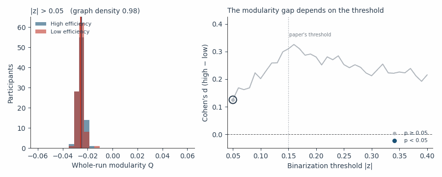
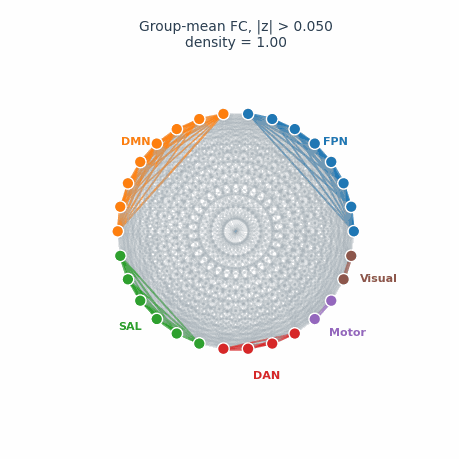
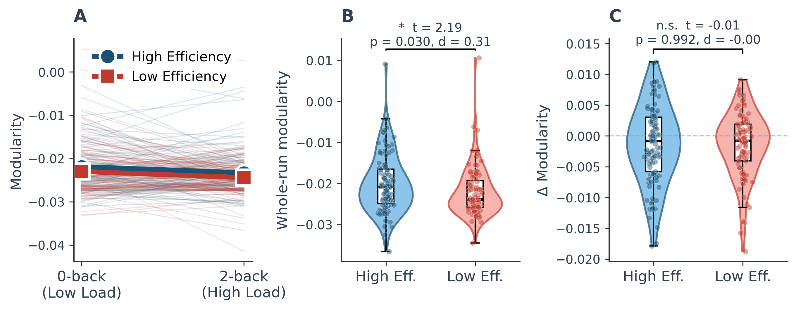
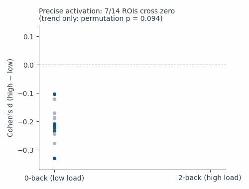
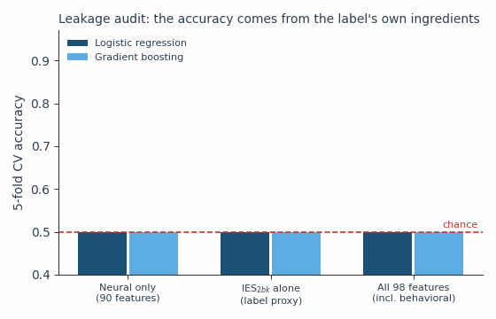
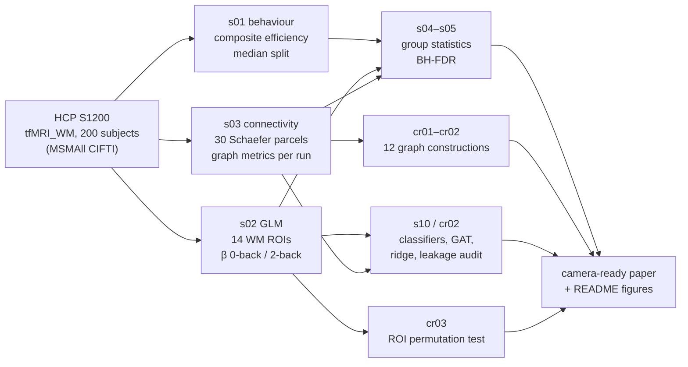

<div align="center">

# Network Stability as the Hallmark of Neural Efficiency Under Cognitive Load

**IEEE BIBM 2026 · Short paper B324 · Dallas, TX, USA**

[](IEEE_manuscript_camera_ready/main.pdf)
[-c0392b)](https://www.humanconnectome.org/)
[](requirements.txt)
[](#data)

Xiaoyan Li · Cuicui Jiang · Yujia Du · Jiaxuan Wei · Xingyue Liu · Jiaoping Chen

</div>

---

Do neurally efficient people **reorganize** their brain networks when a task gets harder, or do they bring a **better-organized network** to the task in the first place? We tested this with N-back working-memory fMRI from 200 Human Connectome Project participants, combining behavior, regional activation, graph theory and machine learning, and we checked every network result against 12 ways of building the graph.

## Findings at a glance

| | Question | Answer |
|---|---|---|
| **H1** | Does 2-back load impair performance? | ✅ Yes, strongly (accuracy 91.9% → 85.5%, RT 753 → 975 ms, *p* < 10⁻²⁰) |
| **H2** | Do efficient people activate "precisely" (less at low load, parity at high load)? | 〰️ A trend in 7/14 ROIs, not significant once ROI dependence is respected (permutation *p* = 0.094) |
| **H3** | Is network organization stable under load? | ✅ Yes, in both groups; Δ modularity does not differ between groups in 11 of 12 graph constructions |
| **H4** | Do efficient people have a better-organized baseline network? | ❌ Not robustly; a small gap at one threshold is explained by graph density |
| **ML** | Can neural features predict who is efficient? | ❌ No; all classifiers and ridge regression are at chance once target leakage is removed |

## 1. The modularity gap depends on how the graph is built

At the paper's original threshold (|z| > 0.15) high-efficiency participants have slightly higher whole-run modularity (*d* = 0.31, *p* = 0.03). Sweeping the threshold shows that this is significant only in a narrow band, and at every threshold the task graphs are dense and *Q* sits close to zero.

<p align="center"></p>

The group-average functional connectivity among the 30 Schaefer parcels explains why: even at |z| > 0.45 about two thirds of all possible edges survive, so the a priori network partition captures very little structure.

<p align="center"></p>

<details>
<summary><b>All 12 graph constructions (Table III of the paper)</b></summary>

| Construction | *Q*<sub>run</sub>: *d* (*p*) | mean of 0-/2-back *Q*: *d* (*p*) | Δ*Q*: *p* |
|---|---|---|---|
| \|z\| > 0.15, binary (original) | 0.31 (0.030) | 0.23 (0.11) | 0.99 |
| \|z\| > 0.05 | 0.13 (0.38) | 0.21 (0.14) | 0.41 |
| \|z\| > 0.10 | 0.20 (0.16) | 0.26 (0.07) | 0.37 |
| \|z\| > 0.20 | 0.28 (0.049) | 0.17 (0.22) | 0.50 |
| \|z\| > 0.25 | 0.25 (0.08) | 0.20 (0.16) | 0.53 |
| z > 0.15 (positive only) | 0.31 (0.029) | 0.21 (0.14) | 0.78 |
| Density 20% | 0.03 (0.86) | 0.13 (0.36) | 0.12 |
| Density 30% | 0.12 (0.39) | 0.16 (0.26) | 0.01 |
| Density 40% | 0.09 (0.51) | 0.13 (0.37) | 0.43 |
| Weighted (positive) | 0.17 (0.22) | 0.15 (0.28) | 0.21 |
| \|z\| > 0.15, Louvain | 0.25 (0.08) | 0.18 (0.21) | 0.08 |
| Weighted, Louvain | 0.18 (0.20) | 0.20 (0.16) | 0.18 |

Source: [`camera_ready/cr02_results.json`](camera_ready/cr02_results.json).
</details>

## 2. Stability under load is shared by everyone

Both groups barely change their network organization from 0-back to 2-back, and the change is the same in both groups.

<p align="center"></p>

## 3. "Precise activation" is a trend, not a result

Most working-memory ROIs move from lower activation in the high-efficiency group at low load toward parity at high load. Seven ROIs cross zero, but no single ROI survives FDR and the count is not significant under a label-permutation test.

<p align="center"></p>

## 4. The leakage audit

Groups are defined by a median split of a behavioral efficiency score. Give a classifier that score's ingredients and it looks impressive; take them away and it drops to chance.

<p align="center"></p>

| Model (90 neural features, 5-fold CV) | Accuracy | AUC | Permutation null (mean ± SD) | *p* |
|---|---|---|---|---|
| Random Forest | 0.580 | 0.586 | 0.497 ± 0.044 | 0.030 (FDR 0.15) |
| SVM (RBF) | 0.535 | 0.527 | 0.495 ± 0.049 | 0.199 |
| Gradient Boosting | 0.525 | 0.548 | 0.496 ± 0.041 | 0.244 |
| Logistic Regression | 0.515 | 0.502 | 0.500 ± 0.045 | 0.408 |
| MLP (64-32-16) | 0.510 | 0.538 | 0.499 ± 0.024 | 0.333 |
| Attention MLP | 0.355 | – | – | n.s. |
| Graph Attention Network (real 14×14 FC) | 0.500 | – | – | n.s. |

Ridge regression on the continuous scores fares no better: cross-validated *R*² = −0.034 ± 0.045 for the composite efficiency score and −0.052 ± 0.092 for IES<sub>2bk</sub>.

## Pipeline



## Repository layout

```
configs/                     paths, parameters, Schaefer-100 parcel definitions
scripts/                     original pipeline, stages s01–s11
camera_ready/                analyses added for the camera-ready version
  cr01_extract_fc.py           re-extract and save per-run 30×30 FC matrices
  cr02_reviewer_analyses.py    12 graph constructions, permutation nulls, ridge regression
  cr03_activation_pattern.py   ROI-count permutation test + Fig. 2
  cr04_fig3.py                 Figs. 1 and 3 (regenerated)
  cr05_readme_assets.py        the GIFs on this page
  cr02_results.json, cr03_results.json
tables/                      subject list and the post-processed feature table
IEEE_manuscript_camera_ready/  LaTeX source and PDF of the BIBM 2026 paper
IEEE_manuscript/             the submitted (anonymized) version, kept for reference
assets/                      README animations
```

## Reproducing

```bash
conda create -n neural_eff python=3.10 -y && conda activate neural_eff
pip install -r requirements.txt

export HCP_DATA_ROOT=/path/to/hcp        # needs tfMRI_WM_{LR,RL} for the IDs in tables/subjects.txt
python run_full_pipeline.py              # stages s01–s10 → results/

python camera_ready/cr01_extract_fc.py        # per-run parcel FC (≈5 min on 24 cores)
python camera_ready/cr02_reviewer_analyses.py # robustness, permutation nulls, ridge
python camera_ready/cr03_activation_pattern.py
python camera_ready/cr04_fig3.py
python camera_ready/cr05_readme_assets.py
```

All stochastic steps use `random_state=42`. The HCP imaging data are not redistributed here and must be obtained from the [Human Connectome Project](https://www.humanconnectome.org/) under its Open Access Data Use Terms. `tables/neural_efficiency.csv` contains only derived per-subject summaries (behavioral scores, ROI betas, network metrics).

## Data

N-back working-memory task fMRI (0-back vs. 2-back, two runs) from 200 healthy young adults of the HCP S1200 release. The subject IDs are in [`tables/subjects.txt`](tables/subjects.txt). One participant lacks 2-back behavioral data; excluding them changes no result.

## Limitations

Family structure (siblings and twins) could not be modeled without HCP Restricted data, so group-level *p*-values are likely somewhat optimistic, while the near-chance classifier results are conservative. The task graphs are dense at every threshold we tried, so the a priori partition is a weak test of baseline organization; sparser, density-controlled graphs over finer parcellations are the natural next step.

## Citation

```bibtex
@inproceedings{li2026networkstability,
  title     = {Network Stability as the Hallmark of Neural Efficiency Under Cognitive Load},
  author    = {Li, Xiaoyan and Jiang, Cuicui and Du, Yujia and Wei, Jiaxuan and Liu, Xingyue and Chen, Jiaoping},
  booktitle = {Proceedings of the IEEE International Conference on Bioinformatics and Biomedicine (BIBM)},
  year      = {2026}
}
```

## Acknowledgment

Data were provided by the Human Connectome Project, WU-Minn Consortium (Principal Investigators: David Van Essen and Kamil Ugurbil; 1U54MH091657) funded by the 16 NIH Institutes and Centers that support the NIH Blueprint for Neuroscience Research; and by the McDonnell Center for Systems Neuroscience at Washington University.
